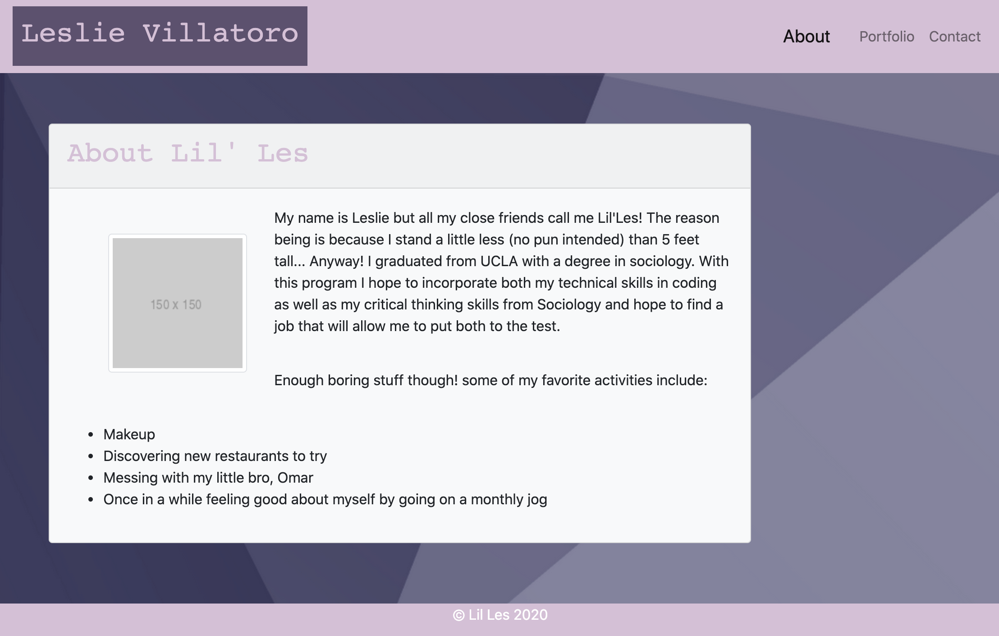

# CSS & Bootstrap (or cssbootsy for short)

This portfolio allows me to put the skills I have been taught to the test! Using Bootstrap's components and grid system, I am able to create a web application that can be rendered well on any device. On my 'About' link, you will find a short description about myself, on my 'Portfolio' link you'll find place holder images, and on my 'Contact' link, a short form to fill out.

## Feautres

This web application consists of: 
 - Navbar 
 - Sticky footer
 - Responsive layout.

 ## Web application Image

 

 Here is the 'Home/About Me' page where you can see the feautures I previously mentioned.

## Built With

* [HTML](https://developer.mozilla.org/en-US/docs/Web/HTML)
* [Bootstrap](https://getbootstrap.com/)
* [Git] - version control system to track changes to source code
* [GitHub] - hosts repository that can be deployed to GitHub Pages

## Deployed Link

* [See Live Site](file:///Users/LesCode/Desktop/cssbootsy/index.html)

## Authors

* **Leslie Villatoro** 

- [Link to Github](https://github.com/leslievill)
- [Link to LinkedIn](www.linkedin.com/in/leslie-villatoro-a3632a1a3)

## License

This project is licensed under the MIT License 

